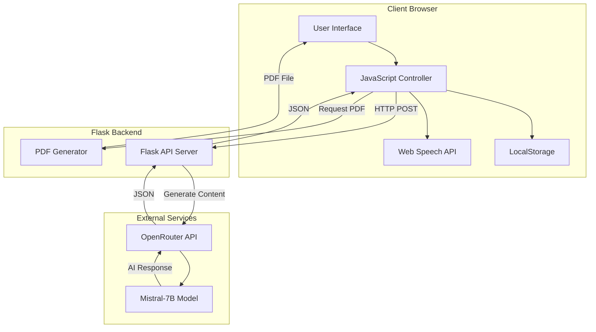

# Design Document: LearnX AI-Powered Learning Platform

## Overview

LearnX is a web-based AI-powered learning platform that enables users to search, learn, and practice technical concepts through an interactive multi-modal interface. The system consists of a Python Flask backend that integrates with AI services (OpenRouter API with Mistral-7B model) and a vanilla JavaScript frontend that provides a responsive, feature-rich user experience.

### Key Design Principles

1. **Separation of Concerns**: Clear boundaries between frontend presentation, backend API logic, and external AI services
2. **Progressive Enhancement**: Core learning features work first, with voice and PDF features as enhancements
3. **Stateless API Design**: Backend endpoints are stateless, with client-side state management for user preferences
4. **AI-First Content Generation**: All educational content is dynamically generated by AI based on user queries
5. **Responsive and Accessible**: Interface adapts to different devices and supports multiple input modalities

### Technology Stack

**Backend:**
- Python 3.x with Flask web framework
- Flask-CORS for cross-origin resource sharing
- ReportLab for PDF generation
- Requests library for external API calls
- OpenRouter API (Mistral-7B model) for AI content generation

**Frontend:**
- Vanilla JavaScript (ES6+)
- HTML5 with semantic markup
- CSS3 with modern layout techniques
- Web Speech API for voice features
- jsPDF library for client-side PDF generation

## Architecture

### System Architecture Diagram



### Request Flow

**Content Generation Flow:**
1. User enters concept and selects difficulty level
2. Frontend sends POST request to `/generate` endpoint with concept, level, and language
3. Backend constructs structured prompt for AI model
4. Backend calls OpenRouter API with Mistral-7B model
5. AI generates structured response (Explanation, Code, Quiz)
6. Backend returns raw AI response as JSON
7. Frontend parses response into three sections using regex
8. Frontend displays content progressively with navigation

**PDF Generation Flow:**
1. User clicks download button on current section
2. Frontend extracts text content from displayed section
3. Frontend uses jsPDF to generate PDF client-side
4. Browser initiates download with descriptive filename

**Voice Features Flow:**
1. Text-to-Speech: Frontend uses Web Speech API SpeechSynthesis to read displayed content
2. Speech-to-Text: Frontend uses Web Speech API SpeechRecognition to capture voice input

### Component Interaction

The system follows a client-heavy architecture where:
- **Frontend** handles: UI rendering, state management, content parsing, voice features, client-side PDF generation
- **Backend** handles: AI API integration, prompt engineering, server-side PDF generation (alternative endpoint)
- **External AI** handles: Content generation based on structured prompts

## Components and Interfaces

### Frontend Components

#### 1. Search and Input Module

**Responsibilities:**
- Capture user search queries
- Provide autocomplete suggestions from predefined concept list
- Support voice input via speech recognition
- Validate and submit search requests

**Key Functions:**
- `showSuggestions()`: Filters concept list based on user input
- `startListening()`: Activates speech recognition for voice search
- `generate()`: Initiates content generation request

**Interface:**
```javascript
// Search input element
<input id="concept" onkeyup="showSuggestions()" />

// Voice input button
<button onclick="startListening()">🎙</button>

// Generate button
<button onclick="generate()">✨ Learn</button>
```

#### 2. Difficulty Level Selector

**Responsibilities:**
- Allow users to select learning difficulty (Beginner/Intermediate/Advanced)
- Maintain selected level state
- Apply visual feedback for active selection

**Key Functions:**
- `setLevel(level)`: Updates selected difficulty level and UI state

**State:**
```javascript
let selectedLevel = "beginner"; // Global state variable
```

#### 3. Language Selector

**Responsibilities:**
- Provide dropdown menu for language selection
- Persist language preference
- Apply selected language to content generation and voice features

**Key Functions:**
- `setLanguage(lang)`: Updates selected language and UI display

**State:**
```javascript
let selectedLanguage = "English"; // Global state variable
```

#### 4. Content Display Module

**Responsibilities:**
- Parse AI-generated content into three sections (Explanation, Code, Quiz)
- Render content with proper formatting (code blocks, line breaks, images)
- Provide progressive navigation between sections
- Display progress indicator

**Key Functions:**
- `showSection()`: Renders current section with formatted content
- `nextSection()`: Advances to next section
- `prevSection()`: Returns to previous section
- `updateProgress()`: Updates visual progress indicator

**State:**
```javascript
let sections = []; // Array of three content sections
let currentStep = 0; // Current section index (0-2)
```

**Content Parsing:**
```javascript
// Regex patterns to extract sections from AI response
const explain = data.result.match(/### Explanation([\s\S]*?)(?=### Code|### Quiz|$)/);
const code = data.result.match(/### Code([\s\S]*?)(?=### Quiz|$)/);
const quiz = data.result.match(/### Quiz([\s\S]*)/);
```

#### 5. Quiz Module

**Responsibilities:**
- Parse quiz questions from AI-generated text
- Render interactive multiple-choice questions
- Capture user answers
- Calculate and display scores
- Provide immediate feedback

**Key Functions:**
- `handleQuizSection(rawText)`: Parses quiz text into structured question objects
- `renderQuiz()`: Displays quiz questions with radio button options
- `checkQuiz()`: Calculates score and displays results

**Data Structure:**
```javascript
let currentQuiz = [
  {
    question: "Question text",
    options: ["option a", "option b", "option c", "option d"],
    answer: 1 // Index of correct answer (0-3)
  }
];
```

#### 6. Voice Features Module

**Responsibilities:**
- Read displayed content aloud using text-to-speech
- Support multiple languages for speech synthesis
- Capture voice input for search queries
- Provide playback controls (play, stop)

**Key Functions:**
- `readAloud()`: Converts displayed text to speech with language-specific voice
- `stopRead()`: Cancels ongoing speech synthesis
- `startListening()`: Activates speech recognition for voice input

**Browser APIs Used:**
- `SpeechSynthesisUtterance`: For text-to-speech
- `SpeechRecognition`: For speech-to-text

#### 7. PDF Export Module

**Responsibilities:**
- Generate PDF from current section content
- Generate PDF from all sections (alternative)
- Trigger browser download with descriptive filename

**Key Functions:**
- `downloadCurrentSection()`: Generates PDF of current section using jsPDF
- Backend endpoint `/download-section`: Server-side PDF generation (alternative)
- Backend endpoint `/download-all`: Server-side full guide PDF generation

#### 8. History and Sidebar Module

**Responsibilities:**
- Store recently searched concepts in localStorage
- Display recent topics for quick access
- Provide YouTube resource links based on current concept

**Key Functions:**
- `saveHistory(concept)`: Stores concept in localStorage (max 3 items)
- `renderHistory()`: Displays recent topics as clickable chips
- `showYouTubeLinks(concept)`: Generates YouTube search links

### Backend Components

#### 1. Flask API Server

**Responsibilities:**
- Serve RESTful API endpoints
- Handle CORS for cross-origin requests
- Route requests to appropriate handlers
- Return JSON responses

**Configuration:**
```python
app = Flask(__name__)
CORS(app)  # Enable cross-origin requests
```

#### 2. Content Generation Handler

**Endpoint:** `POST /generate`

**Responsibilities:**
- Receive content generation requests
- Construct structured prompts for AI model
- Call OpenRouter API with Mistral-7B model
- Return AI-generated content

**Request Format:**
```json
{
  "concept": "Binary Search",
  "level": "beginner",
  "language": "English"
}
```

**Response Format:**
```json
{
  "result": "### Explanation\n...\n### Code\n...\n### Quiz\n..."
}
```

**Prompt Engineering:**
The backend constructs a highly structured prompt that enforces specific formatting:
- Explanation section with 12-15 sentences
- Code section with commented examples
- Quiz section with exactly 5 MCQ questions in strict format
- Language-specific content generation (explanation and quiz in selected language, code in English)

#### 3. PDF Generation Handler

**Endpoints:**
- `POST /download-section`: Generate PDF for single section
- `POST /download-all`: Generate PDF for all sections

**Responsibilities:**
- Receive HTML content from frontend
- Clean HTML tags and format text
- Generate PDF using ReportLab library
- Return PDF file for download

**Request Format:**
```json
{
  "content": "Section text with <br/> tags",
  "sections": ["section1", "section2", "section3"]  // For download-all
}
```

**PDF Generation Process:**
1. Clean HTML break tags from content
2. Create PDF document with A4 page size
3. Split text into paragraphs
4. Apply styling and spacing
5. Build PDF and return as file download

### External Service Integration

#### OpenRouter API Integration

**Service:** OpenRouter API (https://openrouter.ai/api/v1/chat/completions)

**Model:** Mistral-7B-Instruct

**Authentication:** Bearer token in Authorization header

**Request Format:**
```json
{
  "model": "mistralai/mistral-7b-instruct",
  "messages": [
    {
      "role": "user",
      "content": "Structured prompt with concept, level, and language"
    }
  ]
}
```

**Response Format:**
```json
{
  "choices": [
    {
      "message": {
        "content": "AI-generated educational content"
      }
    }
  ]
}
```

**Error Handling:**
- Network failures: Frontend should retry up to 3 times
- API errors: Backend should return error message in JSON
- Rate limiting: Backend should implement request throttling

## Data Models

### Frontend Data Models

#### ConceptSuggestion
```javascript
// Predefined list of technical concepts
const conceptList = [
  "Backpropagation",
  "Neural Networks",
  "Binary Search",
  // ... more concepts
];
```

#### ContentSections
```javascript
// Parsed content from AI response
let sections = [
  "Explanation text with formatting",
  "Code examples with syntax",
  "Quiz questions in structured format"
];
```

#### QuizQuestion
```javascript
{
  question: String,      // Question text
  options: [String],     // Array of 4 option strings
  answer: Number         // Index of correct answer (0-3)
}
```

#### UserPreferences
```javascript
// Stored in localStorage
{
  "learnx_history": ["concept1", "concept2", "concept3"],  // Recent searches
  "selectedLanguage": "English",                            // Preferred language
  "selectedLevel": "beginner"                               // Preferred difficulty
}
```

### Backend Data Models

#### GenerateRequest
```python
{
  "concept": str,      # Technical concept to learn
  "level": str,        # "beginner", "intermediate", or "advanced"
  "language": str      # Target language for content
}
```

#### GenerateResponse
```python
{
  "result": str        # AI-generated content with section markers
}
```

#### PDFRequest
```python
{
  "content": str,      # HTML content to convert
  "sections": [str]    # Array of section contents (for download-all)
}
```

### AI Prompt Structure

The backend constructs prompts with strict formatting requirements:

```
You are an expert computer science tutor.
Your task is to generate STRICTLY STRUCTURED educational content.

Teach the concept "{concept}" at a {level} level in {language} Language.

IMPORTANT:
- Explanation must be in {language}
- Code should remain in English
- Quiz questions and options must be in {language}

Reply ONLY in this exact format:
--------------------------------
### Explanation
[12-15 sentences with examples and analogies]

--------------------------------
### Code
[Python code with comments in triple backticks]

--------------------------------
### Quiz
[Exactly 5 MCQ questions in strict format]
1. Question text
a) option
b) option
c) option
d) option
Answer: b
--------------------------------
```

This structured approach ensures consistent parsing on the frontend.


## Correctness Properties

*A property is a characteristic or behavior that should hold true across all valid executions of a system—essentially, a formal statement about what the system should do. Properties serve as the bridge between human-readable specifications and machine-verifiable correctness guarantees.*

### Property 1: Search Results Contain Required Information

*For any* search query that returns results, all displayed results should include both a concept title and a brief description.

**Validates: Requirements 1.3**

### Property 2: Content Generation for All Difficulty Levels

*For any* valid technical concept and any difficulty level (Beginner, Intermediate, Advanced), the Content_Generator should successfully generate structured content containing explanation, code, and quiz sections.

**Validates: Requirements 2.2, 3.1, 4.1**

### Property 3: Code Examples Include Comments

*For any* generated code example, the code should contain explanatory comments (lines starting with # in Python).

**Validates: Requirements 3.3**

### Property 4: Quiz Generation Minimum Count

*For any* technical concept, the generated quiz should contain at least 5 multiple-choice questions.

**Validates: Requirements 4.2**

### Property 5: Quiz Display Structure

*For any* quiz question being displayed, the rendered HTML should show exactly 4 answer options with radio button inputs.

**Validates: Requirements 4.3**

### Property 6: Quiz Score Calculation Accuracy

*For any* set of quiz answers, the calculated score should equal (number of correct answers / total questions) × 100, and the results display should show the total score, correct count, and incorrect count.

**Validates: Requirements 5.1, 5.2**

### Property 7: Quiz Feedback Completeness

*For any* completed quiz, the feedback should indicate the correctness status (correct/incorrect) for each question and display the correct answer for all incorrect responses.

**Validates: Requirements 5.3, 5.4**

### Property 8: Text-to-Speech API Integration

*For any* non-empty text content, activating text-to-speech should call the SpeechSynthesisUtterance API with the content text and the language matching the user's selected language preference.

**Validates: Requirements 6.2**

### Property 9: Speech-to-Text Field Population

*For any* successful speech recognition result, the search input field should be populated with the recognized text.

**Validates: Requirements 7.3**

### Property 10: Voice Input Visual Feedback

*For any* active voice input session, the UI should display visual feedback indicating recording status (e.g., microphone icon change or recording indicator).

**Validates: Requirements 7.5**

### Property 11: Language Selection Affects Content Generation

*For any* selected language, when generating new content, the API request should include the selected language parameter, and the returned content should be in that language (except code examples which remain in English).

**Validates: Requirements 8.2, 8.5**

### Property 12: Translation Preserves Structure

*For any* content translated to a different language, the number of sections (Explanation, Code, Quiz) and the structure (headings, code blocks, quiz format) should remain unchanged.

**Validates: Requirements 8.3**

### Property 13: Language Preference Persistence Round-Trip

*For any* language selection, storing the preference and then reloading the page should restore the same language selection.

**Validates: Requirements 8.4, 12.1, 12.3**

### Property 14: PDF Content Completeness

*For any* learning section converted to PDF, the generated PDF should contain the section content, concept title, difficulty level, and generation metadata.

**Validates: Requirements 9.2, 9.3, 9.4**

### Property 15: PDF Download Filename Format

*For any* PDF download, the filename should follow a descriptive pattern including the section name or concept identifier.

**Validates: Requirements 9.5**

### Property 16: Responsive Layout Adaptation

*For any* viewport width change, the platform layout should adapt by applying appropriate CSS media query styles (e.g., sidebar collapse on mobile).

**Validates: Requirements 10.3**

### Property 17: Loading Indicator Display

*For any* asynchronous content loading operation, a loading indicator should be visible in the UI until the operation completes.

**Validates: Requirements 10.5**

### Property 18: Backend API Input Validation

*For any* API request with invalid parameters (missing required fields, invalid difficulty level, empty concept), the backend should return an HTTP 400 status code with an error message in JSON format.

**Validates: Requirements 11.3**

### Property 19: API Response Format Consistency

*For any* successful API response, the response should be valid JSON with consistent structure and appropriate HTTP status codes (200 for success, 4xx for client errors, 5xx for server errors).

**Validates: Requirements 11.5**

### Property 20: Quiz History Persistence Round-Trip

*For any* completed quiz with score, saving the quiz result to localStorage and then retrieving it should return the same score and concept information.

**Validates: Requirements 12.2**

### Property 21: Data Clearing Completeness

*For any* stored user data (preferences, history, quiz scores), invoking the clear data function should result in all localStorage items being removed.

**Validates: Requirements 12.5**

### Property 22: Network Retry Logic

*For any* failed network request, the system should automatically retry up to 3 times before displaying an error message to the user.

**Validates: Requirements 13.2**

### Property 23: Error Logging Behavior

*For any* error that occurs during operation, the error details should be logged to the console while displaying a user-friendly simplified message in the UI.

**Validates: Requirements 13.3**

## Error Handling

### Frontend Error Handling

**Network Errors:**
- Implement automatic retry logic (up to 3 attempts) for failed API requests
- Display user-friendly error messages when retries are exhausted
- Provide manual retry buttons for failed operations
- Log detailed error information to console for debugging

**AI Content Generation Errors:**
- Handle cases where AI response doesn't match expected format
- Provide fallback messages when content sections are missing
- Allow users to regenerate content with different parameters

**Voice Feature Errors:**
- Check for browser support before enabling voice features
- Handle speech recognition errors gracefully with retry options
- Provide visual feedback when voice features fail
- Disable voice buttons if Web Speech API is unavailable

**PDF Generation Errors:**
- Validate content before attempting PDF generation
- Handle empty content cases with appropriate messages
- Catch and display errors from jsPDF library
- Provide alternative download options if client-side generation fails

**Storage Errors:**
- Handle localStorage quota exceeded errors
- Provide options to clear old data when storage is full
- Gracefully degrade if localStorage is unavailable
- Use try-catch blocks around all storage operations

### Backend Error Handling

**API Request Validation:**
- Validate all required parameters (concept, level, language)
- Return 400 Bad Request for invalid or missing parameters
- Provide descriptive error messages in JSON format
- Sanitize inputs to prevent injection attacks

**External API Errors:**
- Handle OpenRouter API failures with appropriate error responses
- Implement timeout handling for slow API responses
- Return 503 Service Unavailable when AI service is down
- Log API errors for monitoring and debugging

**PDF Generation Errors:**
- Validate content before PDF generation
- Handle ReportLab exceptions gracefully
- Return 500 Internal Server Error for generation failures
- Provide error details in response for debugging

**Rate Limiting:**
- Implement request rate limiting per IP address
- Return 429 Too Many Requests when limit exceeded
- Include Retry-After header in rate limit responses
- Log rate limit violations for abuse detection

### Error Response Format

All backend errors should follow a consistent JSON format:

```json
{
  "error": true,
  "message": "User-friendly error description",
  "code": "ERROR_CODE",
  "details": "Technical details for debugging (optional)"
}
```

## Testing Strategy

### Dual Testing Approach

The LearnX platform requires both unit testing and property-based testing to ensure comprehensive coverage:

**Unit Tests** focus on:
- Specific examples of content parsing (e.g., parsing a known quiz format)
- Edge cases (empty content, malformed AI responses, missing sections)
- Error conditions (network failures, invalid inputs, API errors)
- Integration points (API endpoints, localStorage operations, browser APIs)
- UI component rendering with specific inputs

**Property-Based Tests** focus on:
- Universal properties that hold for all inputs (e.g., quiz score calculation)
- Content generation across all difficulty levels and languages
- Data persistence round-trips (save and restore operations)
- API response format consistency across all endpoints
- Input validation across all possible invalid inputs

### Property-Based Testing Configuration

**Framework Selection:**
- **Frontend (JavaScript):** Use `fast-check` library for property-based testing
- **Backend (Python):** Use `hypothesis` library for property-based testing

**Test Configuration:**
- Minimum 100 iterations per property test (due to randomization)
- Each property test must reference its design document property
- Tag format: `# Feature: learnx-platform, Property {number}: {property_text}`

**Example Property Test Structure (JavaScript with fast-check):**

```javascript
// Feature: learnx-platform, Property 6: Quiz Score Calculation Accuracy
test('quiz score calculation is accurate for any answer set', () => {
  fc.assert(
    fc.property(
      fc.array(fc.boolean(), { minLength: 5, maxLength: 10 }),
      (answers) => {
        const correctCount = answers.filter(a => a).length;
        const expectedScore = (correctCount / answers.length) * 100;
        const actualScore = calculateQuizScore(answers);
        return Math.abs(actualScore - expectedScore) < 0.01;
      }
    ),
    { numRuns: 100 }
  );
});
```

**Example Property Test Structure (Python with hypothesis):**

```python
# Feature: learnx-platform, Property 18: Backend API Input Validation
@given(
    concept=st.one_of(st.none(), st.just(""), st.text()),
    level=st.one_of(st.none(), st.just("invalid"), st.sampled_from(["beginner", "intermediate", "advanced"])),
    language=st.one_of(st.none(), st.just(""), st.text())
)
@settings(max_examples=100)
def test_api_validates_invalid_inputs(concept, level, language):
    """Property 18: Backend API Input Validation"""
    is_valid = (
        concept and concept.strip() and
        level in ["beginner", "intermediate", "advanced"] and
        language and language.strip()
    )
    
    response = client.post('/generate', json={
        'concept': concept,
        'level': level,
        'language': language
    })
    
    if is_valid:
        assert response.status_code == 200
    else:
        assert response.status_code == 400
        assert 'error' in response.json
```

### Unit Testing Strategy

**Frontend Unit Tests (using Jest or Vitest):**

1. **Content Parsing Tests:**
   - Test parsing of well-formed AI responses
   - Test handling of malformed responses (missing sections, incorrect format)
   - Test extraction of quiz questions from text

2. **UI Component Tests:**
   - Test difficulty level selection updates state
   - Test language selection updates UI and state
   - Test navigation between sections
   - Test quiz answer selection and submission

3. **Storage Tests:**
   - Test saving and retrieving history
   - Test saving and retrieving preferences
   - Test clearing all stored data

4. **Voice Feature Tests:**
   - Mock Web Speech API and test integration
   - Test error handling when API unavailable
   - Test language selection affects voice synthesis

**Backend Unit Tests (using pytest):**

1. **API Endpoint Tests:**
   - Test `/generate` endpoint with valid inputs
   - Test `/generate` endpoint with invalid inputs
   - Test `/download-section` endpoint with valid content
   - Test `/download-all` endpoint with multiple sections

2. **Prompt Construction Tests:**
   - Test prompt includes concept, level, and language
   - Test prompt formatting is correct
   - Test special characters are handled properly

3. **PDF Generation Tests:**
   - Test PDF generation with various content types
   - Test HTML cleaning (removing `<br/>` tags)
   - Test PDF includes required metadata

4. **Error Handling Tests:**
   - Test handling of OpenRouter API failures
   - Test handling of invalid JSON responses
   - Test rate limiting behavior

### Integration Testing

**End-to-End Scenarios:**
1. Complete learning flow: search → select level → view explanation → view code → take quiz
2. Voice input flow: activate voice → speak concept → generate content
3. PDF export flow: generate content → download section → verify PDF content
4. Multi-language flow: select language → generate content → verify translation
5. Persistence flow: set preferences → reload page → verify preferences restored

### Test Coverage Goals

- **Unit Test Coverage:** Minimum 80% code coverage for both frontend and backend
- **Property Test Coverage:** All 23 correctness properties must have corresponding property tests
- **Integration Test Coverage:** All major user flows must have end-to-end tests
- **Error Path Coverage:** All error handling paths must be tested

### Continuous Testing

- Run unit tests on every code commit
- Run property tests in CI/CD pipeline
- Run integration tests before deployment
- Monitor test execution time and optimize slow tests
- Track test coverage trends over time
